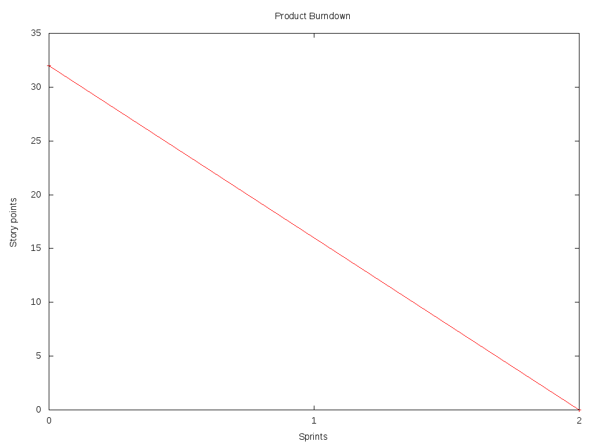

Introduccion
============

El objetivo de este informe es planificar y crear un diseño para el sistema
"Viajemos Juntos". El fin de dicho proyecto es facilitar que distintas
personas compartan un viaje en auto logrando varios beneficions, como ahorro de
combustible y peajes, disminución del volumen de tráfico, menor contaminación
ambiental e incentivar la interacción y comunicación entre sus ciudadanos.

En una primera etapa estará orientado principalmente en viajes laborales, aunque
podría extenderse a cualquier tipo de viajes en un futuro.

El informe está dividido en las siguientes secciones:

- Product backlog: en esta sección se enumeran en forma general todas las
  funcionalidades esperadas una vez finalizado el proyecto

- Sprint Backlog: en esta sección se enumeran en forma más detallada un
  las funcionalidades esperadas en una primera iteración

- Sobre las stories y los sprints: en esta sección se explica la organización
  general del proyecto y la justifiación de las decisiones tomadas en secciones
  anteriores

- Diseño: en esta sección se presenta y justifica las principales decisiones de
  diseño tomadas


Product Backlog
===============

== ====================================================== ======= ===== ======
ID Item                                                   Prority Value Effort
== ====================================================== ======= ===== ======
1  Como desarrollador quiero tener un diseño del sistema  1       10    13
-- ------------------------------------------------------ ------- ----- ------
2  Como usuario con auto quiero ofrecer posibles viajes   2       50    8
   que realizaré con él
-- ------------------------------------------------------ ------- ----- ------
3  Como usuario quiero conocer qué ofertas de viaje       3       40    8
   safisfacen mis requisitos
-- ------------------------------------------------------ ------- ----- ------
4  Como usuario quiero poder registrarme en el sistema    4       35    3
-- ------------------------------------------------------ ------- ----- ------
5  Como usuario sin auto quiero ingresar los datos del    5       30    5
   viaje para que me asigne uno cualquiera que satisfaga
   mi pedido
-- ------------------------------------------------------ ------- ----- ------
6  Como usuario registrado quiero poder consultar en el   6       20    1
   sistema los detalles sobre el viaje que me fue
   asignado
-- ------------------------------------------------------ ------- ----- ------
7  Como usuario registrado quiero recibir notificaciones  7       10    3
   para conocer los detalles sobre el viaje que me fue
   asignado
-- ------------------------------------------------------ ------- ----- ------
8  Como usuario quiero que se confirme la autenticidad de 8       5     5
   mi email al momento de registrarme
-- ------------------------------------------------------ ------- ----- ------
9  Como usuario registrado quiero visualizar en un mapa   9       15    8
   el recorrido para recibir un feedback visual
-- ------------------------------------------------------ ------- ----- ------
10 Como usuario registrado quiero que se me asigne un     10      35    13
   viaje de forma óptima para minimizar la contaminación
   ambiental, el volumen del tráfico y uso de combutible
-- ------------------------------------------------------ ------- ----- ------
11 Como usuario quiero tener una interfaz simple, e       11      35    13
   intuitiva para usar el sistema
-- ------------------------------------------------------ ------- ----- ------
12 Como desarrollador quiero probar la integración de los 12      10    13
   distintos módulos del sistema para poder verificar su
   correcto funcionamiento
-- ------------------------------------------------------ ------- ----- ------
13 Como desarrollador quiero poner el sistema en          13      50    13
   producción
== ====================================================== ======= ===== ======


Justificación de los *values*
-----------------------------

La decisión acerca de los *values* de los ítems del *Product Backlog* es
responsabidad del *Product Owner*. Ante la ausencia de esta información para
este trabajo, elegimos valores que nos parecieron razonables poniéndonos en ese
papel.


Justificación de los *efforts*
------------------------------

Consideramos que la *user story* con menor esfuerzo asociado es la #6,
ya que sólo implica poder consultar los resultados de la estrategia
utilizada por el organizador de viajes; el algoritmo utilizado para la misma
está ya contemplado por el ítem #5, de mayor prioridad, por lo que no sería
necesario tenerlo en cuenta para este punto. A partir de esa user story,
puntuamos el resto de las estimaciones en forma relativa, usando la secuencia de
Fibonacci.



La #4 sólo implica poder registrar un usuario, lo cual abarca el ingreso de
pocos datos y validaciones muy simples de éstos. Razón por la cual ésta es la
siguiente en cantidad de esfuerzo relativo.

La #5, en cambio, conlleva el desarrollo de un algoritmo de *matching*
primitivo y muy simple. Esto, creemos, es solo un poco más complejo que la story
anterior, y por eso consideramos que implica un esfuerzo de 5.

La #2 y la #3 tienen un esfuerzo similar y son más complejas ya que
implican registrar el ingreso de los datos de viaje, además de la creación de
todas las entidades con las que luego se hará el matching. Por esto es que
creemos que son más complejas que las anteriores y merecen un esfuerzo de 8.

La #1 implica el diseño de todo el sistema, teniendo en cuenta extensibilidad,
cohesión y bajo acoplamiento de código. Esta story es, sin lugar a dudas, una de
las más complejas y prioritarias. Cualquier error no detectado en el diseño
puede tener un alto costo en las siguientes etapas del proyecto. Y todo el resto
de las stories necesitan, en mayor o menor medida, conocer el diseño del
sistema.

La #7 solo requiere el envío de un email notificando las asignaciones ya
realizadas, por lo que nos pareció simple y un esfuerzo de 3. En cambio, la #8
le pusimos un esfuerzo mayor porque nadie en el equipo conoce las mejores
prácticas, ni su complejidad, para autenticar un email. La #9 tiene un
esfuerzo aún mayor por la integración con algún sistema de mapas.

El resto de las stories nos parecieron bastante difíciles. La #10 implica el
desarrollo de un algoritmo muy sofisticado de matching. La #11 incluye
investigar sobre el framework a usar para la interfaz de usuario. La #12 abarca
todo la creación de tests de sistema y verificación del correcto funcionamiento
del mismo. La #13 incluye la configuración de los servidores, el registro de
dominio, DNSs y demás detalles de infraestructura necesarios.


Sprint Backlog
==============

.. TODO: poner que programacion incluye testing y debug

A cada *story point*, le asociamos 4 horas de desarrollo. Luego, las
tareas asociadas a los stories #1 y #2 quedarían estimadas como se
detalla a continuación.

Story #1
--------

Criterio de aceptación:

- El usuario puede ingresar al sistema con su email y contraseña.
- El sistema impide el ingreso al sistema al usuario cuando su
  email y contraseña no coinciden.
- El usuario puede crear una oferta de viaje indicando que dispone
  de auto e ingresar lugar, día y horario de salida y de llegada.

Task #1
```````

=================== ===================================================
Descripción         Investigar tecnología conveniente para la interfaz
                    de usuario.
------------------- ---------------------------------------------------
Status              Not Yet Started
------------------- ---------------------------------------------------
Original Estimate   8 horas
------------------- ---------------------------------------------------
Remaining Estimate  8 horas
------------------- ---------------------------------------------------
Time Spent          0 horas
=================== ===================================================

Task #2
```````

=================== ===================================================
Descripción         Crear elementos de interfaz necesarios para la
                    autenticación de usuarios.
------------------- ---------------------------------------------------
Status              Not Yet Started
------------------- ---------------------------------------------------
Original Estimate   2 horas
------------------- ---------------------------------------------------
Remaining Estimate  2 horas
------------------- ---------------------------------------------------
Time Spent          0 horas
=================== ===================================================

Task #3
```````

=================== ===================================================
Descripción         Programar validación de datos ingresados por el
                    usuario.
------------------- ---------------------------------------------------
Status              Not Yet Started
------------------- ---------------------------------------------------
Original Estimate   4 horas
------------------- ---------------------------------------------------
Remaining Estimate  4 horas
------------------- ---------------------------------------------------
Time Spent          0 horas
=================== ===================================================

Task #4
```````

=================== ===================================================
Descripción         Programar mecanismo de autenticación de usuarios.
------------------- ---------------------------------------------------
Status              Not Yet Started
------------------- ---------------------------------------------------
Original Estimate   4 horas
------------------- ---------------------------------------------------
Remaining Estimate  4 horas
------------------- ---------------------------------------------------
Time Spent          0 horas
=================== ===================================================

Task #5
```````

=================== ===================================================
Descripción         Crear elementos de interfaz necesarios para el
                    ingreso de datos para oferta de viaje.
------------------- ---------------------------------------------------
Status              Not Yet Started
------------------- ---------------------------------------------------
Original Estimate   4 horas
------------------- ---------------------------------------------------
Remaining Estimate  4 horas
------------------- ---------------------------------------------------
Time Spent          0 horas
=================== ===================================================

Task #6
```````

=================== ===================================================
Descripción         Programar ingreso de datos para oferta de viaje.
------------------- ---------------------------------------------------
Status              In Progress
------------------- ---------------------------------------------------
Original Estimate   6 horas
------------------- ---------------------------------------------------
Remaining Estimate  6 horas
------------------- ---------------------------------------------------
Time Spent          4 horas
=================== ===================================================

Task #7
```````

=================== ===================================================
Descripción         Crear las entidades necesarias para una nueva
                    oferta de viaje.
------------------- ---------------------------------------------------
Status              Not Yet Started
------------------- ---------------------------------------------------
Original Estimate   6 horas
------------------- ---------------------------------------------------
Remaining Estimate  6 horas
------------------- ---------------------------------------------------
Time Spent          0 horas
=================== ===================================================

Task #8
```````

=================== ===================================================
Descripción         Persistir los datos de la oferta generada.
------------------- ---------------------------------------------------
Status              Not Yet Started
------------------- ---------------------------------------------------
Original Estimate   4 horas
------------------- ---------------------------------------------------
Remaining Estimate  4 horas
------------------- ---------------------------------------------------
Time Spent          0 horas
=================== ===================================================

Story #2
--------

Criterio de aceptación:

- El usuario puede ingresar al sistema con su email y contraseña.
- El sistema impide el ingreso al sistema al usuario cuando su
  email y contraseña no coinciden.
- El usuario puede ingresar un horario, un lugar de salida, así
  un como lugar llegada, y obtener todas las ofertas que los
  satisfacen.

Task #1
```````

=================== ===================================================
Descripción         Crear elementos de interfaz necesarios para el
                    ingreso de datos para pedido de viaje.
------------------- ---------------------------------------------------
Status              Not Yet Started
------------------- ---------------------------------------------------
Original Estimate   4 horas
------------------- ---------------------------------------------------
Remaining Estimate  4 horas
------------------- ---------------------------------------------------
Time Spent          0 horas
=================== ===================================================

Task #2
```````

=================== ===================================================
Descripción         Programar validación de datos ingresados para el
                    pedido de viaje.
------------------- ---------------------------------------------------
Status              Not Yet Started
------------------- ---------------------------------------------------
Original Estimate   4 horas
------------------- ---------------------------------------------------
Remaining Estimate  4 horas
------------------- ---------------------------------------------------
Time Spent          0 horas
=================== ===================================================

Task #3
```````

=================== ===================================================
Descripción         Programar ingreso de datos para pedido de viaje.
------------------- ---------------------------------------------------
Status              In Progress
------------------- ---------------------------------------------------
Original Estimate   4 horas
------------------- ---------------------------------------------------
Remaining Estimate  2 horas
------------------- ---------------------------------------------------
Time Spent          2 horas
=================== ===================================================

Task #4
```````

=================== ===================================================
Descripción         Investigar sobre algoritmo de matching primitivo
                    que permita al usuario encontrar ofertas de viaje
                    de su interés.
------------------- ---------------------------------------------------
Status              Not Yet Started
------------------- ---------------------------------------------------
Original Estimate   4 horas
------------------- ---------------------------------------------------
Remaining Estimate  4 horas
------------------- ---------------------------------------------------
Time Spent          0 horas
=================== ===================================================

Task #5
```````

=================== ===================================================
Descripción         Programar algoritmo de matching primitivo que
                    permita al usuario encontrar ofertas de viaje de su
                    interés.
------------------- ---------------------------------------------------
Status              Not Yet Started
------------------- ---------------------------------------------------
Original Estimate   12 horas
------------------- ---------------------------------------------------
Remaining Estimate  12 horas
------------------- ---------------------------------------------------
Time Spent          0 horas
=================== ===================================================

Task #6
```````

=================== ===================================================
Descripción         Crear las entidades necesarias para un nuevo pedido
                    de viaje.
------------------- ---------------------------------------------------
Status              Not Yet Started
------------------- ---------------------------------------------------
Original Estimate   6 horas
------------------- ---------------------------------------------------
Remaining Estimate  6 horas
------------------- ---------------------------------------------------
Time Spent          0 horas
=================== ===================================================

Task #7
```````

=================== ===================================================
Descripción         Crear elementos de interfaz necesarios para mostrar
                    al usuario las ofertas de viaje de su interés.
------------------- ---------------------------------------------------
Status              Not Yet Started
------------------- ---------------------------------------------------
Original Estimate   4 horas
------------------- ---------------------------------------------------
Remaining Estimate  4 horas
------------------- ---------------------------------------------------
Time Spent          0 horas
=================== ===================================================

Se puede apreciar el progreso hasta ahora alcanzado en el task burndown chart.

Sobre las stories y los sprints
===============================

El proyecto se efectuará en 2 sprints. Para el primero, elegimos las stories #1 y #2,
indicadas en la tabla anterior, las cuales son las de mayor importancia para el
cliente. Ambas suman una cantidad de 16 story points (del total de 31).

El equipo prefirió no comprometerse e incluir ninguna story más del Product
Backlog, para no establecer expectativas demasiado altas en el cliente, aunque,
si el tiempo lo permite, se podría intentar el desarrollo de la story #3 antes de
que finalice el sprint, de forma tal de completar las primeras 3 stories durante
el mismo.

Inicialmente, las stories incluidas en este sprint sólo abarcaban la
funcionalidad para crear cuentas de usuario y que los usuarios registrados
pudieran ingresar al sitio los datos necesarios para poder cumplir sus necesidades
de transporte, o incluso, poner a disposición un auto propio, pero sin contemplar
la posibilidad de organizar viajes a través del sistema.

Se consideró luego, que un hipotético P.O. se beneficiaría más al poder incluir
al menos cierta funcionalidad básica de organización de viajes en este mismo release,
de forma tal, de obtener un producto que pudiese ser lanzado a producción de
manera inmediata.

Adicionalmente, teniendo en cuenta que al agregar la story que producía los viajes
óptimos para los datos ingresados por los usuarios, el sprint se volvería demasiado
abultado y difícilmente podría cumplirse en el tiempo deseado, se decidió dividir
las stories antiguas en otras algo más simples.

Primero, el alta de la cuenta del usuario se separó en una story propia, de forma
tal que pueda ser desarrollada más adelante en otro sprint, aligerando la estimación
de las stories incluídas. Dado este cambio, el sistema podría comenzar a funcionar,
sin esta funcionalidad, en una etapa inicial donde la participación estaría cerrada
a algunos usuarios ingresados en forma masiva a una base de datos o por pedido explícito
por fuera del sistema.

Luego se planteó que podrían satisfacerse las necesidades de los usuarios si estos
pudiesen conocer cuales son las ofertas de autos disponibles que coinciden con sus
horarios y destinos; luego ellos mismos podrían elegir cuál de las ofertas mostradas
les resultarían preferibles.
Se decidíó que la funcionalidad anterior podría comprender una story nueva, la cual
no incluiría el requisito de registrar los datos de viaje del usuario en una base del
sistema. Además, permitiría obtener al menos las ofertas filtradas según su correspondencia 
con las necesidades del usuario. 
También, se agregaría un requisito de investigar las estrategias posibles de matcheo entre
pedidos y ofrecimientos que amortice el costo del desarrollo. 
De esta forma, y como se aclaró antes, la story que incluye el algoritmo de matcheo, 
tendría un esfuerzo menor.

Satisfechos con esta nueva disposición de stories, decidimos incluir esta nueva story
y la que permita registrar un auto para disposición del sistema (la de mayor
importancia), e iniciar el primer sprint.

Diseño
======

Con respecto al diseño se tomaron distintas decisiones con el fin de mantenerlo lo
más flexible que sea posible y abierto a nuevas decisiones y cambios sobre
distintos ejes.

Se consideraron varias estrategias para representar los diferentes puntos de
partida de los viajes de los usuarios, como representarlos mediantes coordenadas,
dividir todo el territorio disponible en zonas chicas e indivisibles o usar
direcciones de calles reales las cuales podrían ser ubicadas gracias a un
servicio interno. Para que ninguna de estas posibilidades quede descartada de
entrada se incluyó la clase ``Place``, la cual responde a un protocolo que permite
conocer la distancia entre cualquier par de puntos, independientemente de la
implementación subyacente. Por ejemplo, se podría utilizar una clase Address la cual 
consulte con un servicio web externo, y la misma podría cambiarse por cualquier 
otra implementación que respete el mismo protocolo sin problemas.

Se decidió además representar el pedido de viaje (``JourneyRequest``) y el ofrecimiento
de auto (``JourneyOffer``) mediante clases diferentes ya que poseían atributos en
común pero el protocolo y comportamiento que manifestaban era distinto.
En ambas hay un lugar destino, otro origen y un horario, este último se representa
con la clase ``Timetable``.

La clase ``Timetable``, representa la frecuencia y las circunstancias temporales en
las que se realiza el viaje (o potencialmente algún otro evento). Como queríamos
dejar abierto que se pudiesen especificar rutinas como "todos los lunes
a las 8 AM",
o "de lunes a jueves a las 8:30 AM y los viernes a las 9:00 AM", esta clase permite
modelar distintas maneras de organizar los horarios de viajes, desde un horario
y día fijos, por ejemplo, como otros con frecuencia semanal.

Finalmente, las otras 3 clases importantes que vale la pena aclarar son
``JourneyOrganizer``, junto con ``Journey`` y ``JourneyStop``. La primera recibe como entrada
un conjunto de pedidos y ofertas para un día determinado, y tiene que ser capaz de
organizar los distintos viajes posibles de forma óptima según algún criterio
determinado. 
Los viajes producidos se representan con la clase ``Journey``, la cual
comprende una fecha específica para el viaje además de quién será el encargado de aportar
el transporte necesario para ese viaje en particular. Luego, las
``JourneyStops``
representan los puntos intermedios del viaje donde deben subir o bajar los distintos
pasajeros, permitiendo que los viajes puedan ser diagramados con mucha flexibilidad.
