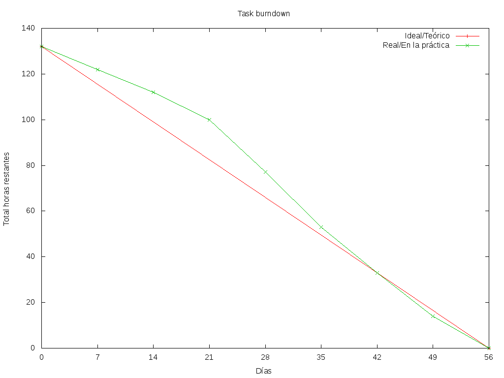
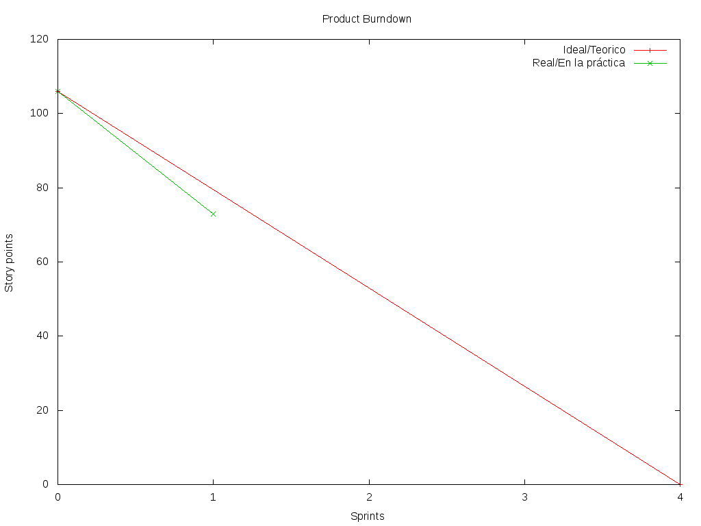

Introducción
============

El objetivo de este informe es planificar y crear un diseño para el sistema
"Viajemos Juntos". El fin de dicho proyecto es facilitar que distintas
personas compartan un viaje en auto logrando varios beneficions, como ahorro de
combustible y peajes, disminución del volumen de tráfico, menor contaminación
ambiental e incentivar la interacción y comunicación entre sus ciudadanos.

En una primera etapa estará orientado principalmente en viajes laborales, aunque
podría extenderse a cualquier tipo de viajes en un futuro.

El proyecto se dividirá en iteraciones y se hará en forma incremental,
obteniendo al final de cada iteración una versión más cercana al producto final
esperado. Se decidió utilizar "Scrum" como metodología de desarrollo y en dicha
metodología a cada iteración se la llama "Sprint".

El informe está dividido en las siguientes secciones:

- Product backlog: en esta sección se enumeran en forma general todas las
  funcionalidades esperadas una vez finalizado el proyecto

- Sprint backlog: en esta sección se enumeran en forma más detallada un
  las funcionalidades esperadas en una primera iteración

- Burndown charts: en esta sección se muestran el product burndown chart y el
  sprint burndown chart mostrando el avance del proyecto y el sprint
  respectivamente.

- Diseño: en esta sección se presenta y justifica las principales decisiones de
  diseño tomadas


Product Backlog
===============

== ====================================================== ======= ===== ======
ID Item                                                   Prority Value Effort
== ====================================================== ======= ===== ======
1  Como desarrollador quiero tener un diseño del sistema  1       10    13
-- ------------------------------------------------------ ------- ----- ------
2  Como usuario con auto quiero ofrecer posibles viajes   2       40    5
   que realizaré con él
-- ------------------------------------------------------ ------- ----- ------
3  Como usuario quiero poder registrarme en el sistema    3       35    3
-- ------------------------------------------------------ ------- ----- ------
4  Como usuario quiero poder loguearme en el sistema      4       35    3
-- ------------------------------------------------------ ------- ----- ------
5  Como usuario quiero ingresar los datos del viaje para  5       30    3
   que me asigne uno cualquiera que satisfaga mi pedido
-- ------------------------------------------------------ ------- ----- ------
6  Como usuario registrado quiero recibir notificaciones  6       40    5
   semanales para conocer los detalles sobre el viaje que
   me fue asignado
-- ------------------------------------------------------ ------- ----- ------
7  Como usuario registrado quiero poder consultar en el   7       20    1
   sistema los detalles sobre el viaje que me fue
   asignado
-- ------------------------------------------------------ ------- ----- ------
8  Como usuario quiero que se confirme la autenticidad de 8       5     5
   mi email al momento de registrarme
-- ------------------------------------------------------ ------- ----- ------
9  Como usuario registrado quiero visualizar en un mapa   9       15    8
   el recorrido para recibir un feedback visual
-- ------------------------------------------------------ ------- ----- ------
10 Como usuario registrado quiero que se me asigne un     10      35    13
   viaje de forma óptima para minimizar la contaminación
   ambiental, el volumen del tráfico y uso de combutible
-- ------------------------------------------------------ ------- ----- ------
11 Como usuario quiero tener una interfaz simple e        11      35    13
   intuitiva para usar el sistema
-- ------------------------------------------------------ ------- ----- ------
12 Como desarrollador quiero probar la integración de los 12      10    13
   distintos módulos del sistema para poder verificar su
   correcto funcionamiento
-- ------------------------------------------------------ ------- ----- ------
13 Como desarrollador quiero poner el sistema en          13      50    13
   producción
-- ------------------------------------------------------ ------- ----- ------
14 Como usuario registrado quiero recibir una             14      20    8
   notificación semanal por email con un formato amigable
   de los viajes asignados

== ====================================================== ======= ===== ======


Justificación de los *values*
-----------------------------

La decisión acerca de los *values* de los ítems del *Product Backlog* es
responsabidad del *Product Owner*. Ante la ausencia de esta información para
este trabajo, elegimos valores que nos parecieron razonables poniéndonos en ese
papel.


Justificación de los *efforts*
------------------------------

Consideramos que la *user story* con menor esfuerzo asociado es la #7,
ya que sólo implica poder consultar los resultados de la estrategia
utilizada por el organizador de viajes; el algoritmo utilizado para la misma
está ya contemplado por el ítem #6, de mayor prioridad, por lo que no sería
necesario tenerlo en cuenta para este punto.

A partir de la user story #7, puntuamos el resto de las estimaciones en forma
relativa, usando la secuencia de Fibonacci.

La #3 sólo implica poder registrar un usuario, lo cual abarca el ingreso de
pocos datos y validaciones muy simples de éstos. Razón por la cual ésta es la
siguiente en cantidad de esfuerzo relativo. Y lo mismo para la #4, ya que
también solo implica poder loguearse en el sistema.

La #2 y la #6 tienen un esfuerzo similar, dado que la #6 conlleva el
desarrollo de un algoritmo de *matching* primitivo y una notificación muy
simple. La #2 implica registrar el ingreso de los datos de viaje, además de la
creación de todas las entidades con las que luego se hará el matching. Creemos
que son solo un poco más complejas que la story #3 o la #4, y por eso
consideramos que implican un esfuerzo de 5.

La #1 implica el diseño de todo el sistema, teniendo en cuenta extensibilidad,
cohesión y bajo acoplamiento de código. Esta story es, sin lugar a dudas, una de
las más complejas y prioritarias. Cualquier error no detectado en el diseño
puede tener un alto costo en las siguientes etapas del proyecto. Y todo el resto
de las stories necesitan, en mayor o menor medida, conocer el diseño del
sistema.

La #5 es solo ingresar datos de un pedido de viaje, que serán tenidos en cuenta
para realizar el matching, por lo que nos pareció simple y un esfuerzo de 3.  En
cambio, la #8 le pusimos un esfuerzo mayor porque nadie en el equipo conoce las
mejores prácticas, ni su complejidad, para autenticar un email. La #9 tiene un
esfuerzo aún mayor por la integración con algún sistema de mapas.

La #14 implica el uso de tecnologías nunca usadas por nadie del equipo e
investigación de un framework para el envío de emails. Por esto es que creemos
que tiene un esfuerzo de 8.

El resto de las stories nos parecieron bastante difíciles. La #10 implica el
desarrollo de un algoritmo muy sofisticado de matching. La #11 incluye
investigar sobre el framework a usar para la interfaz de usuario. La #12 abarca
todo la creación de tests de sistema y verificación del correcto funcionamiento
del mismo. La #13 incluye la configuración de los servidores, el registro de
dominio, DNSs y demás detalles de infraestructura necesarios.

Sprint Backlog
==============

El primer sprint abarca las stories 1 a 7 y finaliza el Lunes 21 de mayo, con
la presentación de una DEMO al cliente. Estas stories suman 33 story points de
un total de 106.

A cada *story point*, le asociamos 4 horas de desarrollo, dando un total de 132
horas para los 33 story points. Y el equipo puede trabajar 20 horas por semana
(5hs cada uno por semana), dando un total de 160hs por sprint. Esta elección fue
hecha en base a trabajos pasados que hemos realizado en otras materias.

El equipo prefirió no comprometerse e incluir ninguna story más del Product
Backlog, para no establecer expectativas demasiado altas en el cliente, aunque,
si el tiempo lo permite, se podría intentar el desarrollo de la story #8 antes de
que finalice el sprint, de forma tal de completar las primeras 8 stories durante
el mismo.

También, es importante notar que las tareas de testing de unidad y debugging
están incluídas como parte de las tareas de programación.

Las tareas asociadas a los stories de este sprint quedarían estimadas como se
detalla a continuación.

Story #1
--------

No se nos ocurrió una forma correcta de agregar en un user story el tiempo
dedicado a la realización de todo el informe para la entrega del trabajo
práctico. Sin embargo, sí encontramos una forma de mostrar en una user story el
tiempo dedicado al diseño, sus charts y justificación. Esta user story refleja
la forma que encontramos de hacerlo.

Criterio de aceptación:

- El desarrollador cuenta con conjunto de diagramas explicando el diseño
  
- El desarrollador cuenta con la justificación de las principales decisiones de
  diseño tomadas

Task #1
```````

=================== ===================================================
Descripción         Crear todos los documentos necesarios para explicar
                    adecuadamente el diseño del sistema
------------------- ---------------------------------------------------
Status              Finished
=================== ===================================================

Task #2
```````

=================== ===================================================
Descripción         Justificar las decisiones de diseño tomadas
------------------- ---------------------------------------------------
Status              Finished
=================== ===================================================


Story #2
--------

Criterio de aceptación:

- El usuario puede crear una oferta de viaje indicando que dispone de auto, la
  cantidad de lugares disponibles e ingresar el lugar, día y horario de salida y
  llegada

Task #1
```````

=================== ===================================================
Descripción         Programar ingreso de datos para oferta de viaje.
------------------- ---------------------------------------------------
Status              Finished
=================== ===================================================

Task #2
```````

=================== ===================================================
Descripción         Crear las entidades necesarias para una nueva
                    oferta de viaje.
------------------- ---------------------------------------------------
Status              Finished
=================== ===================================================

Story #3
--------

Criterio de aceptación:

- Si el usuario no se ha registrado aún, puede registrarse ingresando Nombre y
  su dirección de correo electrónico

- Si el usuario ya se ha registrado, se emite un error indicando el problema


Task #1
```````

=================== ===================================================
Descripción         Crear las entidades necesarias para crear un
                    nuevo usuario
------------------- ---------------------------------------------------
Status              Finished
=================== ===================================================


Task #2
```````

=================== ===================================================
Descripción         Crear mecanismos de validación para usuarios
                    existentes
------------------- ---------------------------------------------------
Status              Finished
=================== ===================================================

Story #4
--------

Criterio de aceptación:

- Si el usuario ya se ha registrado, puede loguearse con los datos usados en la
  registración

- Si el usuario no se ha registrado, se muestra un error y no se le permite
  loguearse


Task #1
```````

=================== ===================================================
Descripción         Programar la lógica de loguear usuarios
------------------- ---------------------------------------------------
Status              Finished
=================== ===================================================

Story #5
--------

Criterio de aceptación:

- El usuario puede ingresar un horario, un lugar de salida, así
  como de llegada.


Task #1
```````

=================== ===================================================
Descripción         Programar ingreso de datos para pedido de viaje.
------------------- ---------------------------------------------------
Status              Finished
=================== ===================================================

Task #2
```````

=================== ===================================================
Descripción         Crear las entidades necesarias para que un nuevo
                    pedido de viaje sea contemplado en la asignación de
                    viajes
------------------- ---------------------------------------------------
Status              Finished
=================== ===================================================


Story #6
--------

Criterio de aceptación:

- En caso de que existan ofertas de viaje con lugares disponibles y  que cumplan
  con los requisitos de viajes ingresados, se debería asignar y notificar las
  asignaciones realizadas

- En caso de que no existan ofertas de viaje con lugares disponibles y que
  cumplan con los requisitos de viajes ingresados, se informará esta situación

Task #1
```````

=================== ===================================================
Descripción         Programar algoritmo de matching primitivo que
                    asigne los usuarios a viajes
------------------- ---------------------------------------------------
Status              Finished
=================== ===================================================

Task #2
```````

=================== ===================================================
Descripción         Notificar el resultado del matching, detallando la
                    información de las asignaciones en caso que se
                    hayan podido realizar
------------------- ---------------------------------------------------
Status              Finished
=================== ===================================================

Story #7
--------

Criterio de aceptación:

- Se muestran los viajes asignados por el matching si los hay. Sino, se muestra
  que no se pudo asignar ningún viaje

Task #1
```````

=================== ===================================================
Descripción         Programar la lógica para consultar los viajes
                    asignados
------------------- ---------------------------------------------------
Status              Finished
=================== ===================================================


Burndown Charts
===============

A continuación se muestra el task burndown correspondiente a este sprint,
basado en las tareas y estimaciones previamente detalladas:



En este gráfico se puede apreciar el progreso en horas que se fue haciendo a lo
largo del sprint, día a día. Se decidió agrupar por períodos de 7 días para una
mejor visualización.

Se usaron 56 días en el eje "X" porque eso es lo que duró el primer sprint (la
cantidad de días desde la presentación del TP hasta que se debe presentar la
DEMO). Sobre el eje "Y", la cantidad total de horas se la calculó simplemente
usando los valores previamente exlicados: 33 story points, donde cada uno se
corresponde con 4hs, implica un total de 132 horas para los 33 story points.

Se puede ver como durante el principio del sprint se iba más atrasado del "avance
teórico", y que llegando al final del sprint se pudo avanzar bastante, llegando a
superar por un momento el "avance teórico" para esa etapa del proyecto.

En el product burndown a continuación, se muestra el avance sobre la totalidad del
proyecto:




Considerando que cada sprint dura 8 semanas (56 días) y que el equipo trabaja
20hs por semana, el equipo puede avanzar 160hs por sprint. Dado que hay 132
story points y que cada uno implica 4hs, se necesitan 528hs para terminar el
proyecto. Esto implica un poco más de 3 sprints para finalizar el proyecto, y se
decidió usar 4 en total por posibles errores en las estimaciones. Y para
calcular la cantidad de story points totales, simplemente se sumó los story
points de cada user story. 

Se puede ver que actualmente está adelantado el proyecto comparando con el
"avance teórico" esperado. Esto, posiblemente, se deba justamente por redondear
para arriba la cantidad de sprints necesarios para el proyecto total, combinado
con que quizás este sprint se lo estimó mejor. Posiblemente en futuros sprints
hayan más sorpresas si no se estimaron muy bien las otras user stories.


Diseño
======

Con respecto al diseño se tomaron distintas decisiones con el fin de mantenerlo lo
más flexible que sea posible y abierto a nuevas decisiones y cambios sobre
distintos ejes.

Se consideraron varias estrategias para representar los diferentes puntos de
partida de los viajes de los usuarios, como representarlos mediantes coordenadas,
dividir todo el territorio disponible en zonas chicas e indivisibles o usar
direcciones de calles reales las cuales podrían ser ubicadas gracias a un
servicio interno. Para que ninguna de estas posibilidades quede descartada de
entrada se incluyó la clase ``Place``, la cual responde a un protocolo que permite
conocer la distancia entre cualquier par de puntos, independientemente de la
implementación subyacente. Por ejemplo, se podría utilizar una clase Address la cual 
consulte con un servicio web externo, y la misma podría cambiarse por cualquier 
otra implementación que respete el mismo protocolo sin problemas.

Se decidió además representar el pedido de viaje (``JourneyRequest``) y el ofrecimiento
de auto (``JourneyOffer``) mediante clases diferentes ya que poseían atributos en
común pero el protocolo y comportamiento que manifestaban era distinto.
En ambas hay un lugar destino, otro origen y un horario, este último se representa
con la clase ``Timetable``.

La clase ``Timetable``, representa la frecuencia y las circunstancias temporales en
las que se realiza el viaje (o potencialmente algún otro evento). Como queríamos
dejar abierto que se pudiesen especificar rutinas como "todos los lunes
a las 8 AM",
o "de lunes a jueves a las 8:30 AM y los viernes a las 9:00 AM", esta clase permite
modelar distintas maneras de organizar los horarios de viajes, desde un horario
y día fijos, por ejemplo, como otros con frecuencia semanal.

Finalmente, las otras 3 clases importantes que vale la pena aclarar son
``JourneyOrganizer``, junto con ``Journey`` y ``JourneyStop``. La primera recibe como entrada
un conjunto de pedidos y ofertas para un día determinado, y tiene que ser capaz de
organizar los distintos viajes posibles de forma óptima según algún criterio
determinado. 
Los viajes producidos se representan con la clase ``Journey``, la cual
comprende una fecha específica para el viaje además de quién será el encargado de aportar
el transporte necesario para ese viaje en particular. Luego, las
``JourneyStops``
representan los puntos intermedios del viaje donde deben subir o bajar los distintos
pasajeros, permitiendo que los viajes puedan ser diagramados con mucha flexibilidad.

